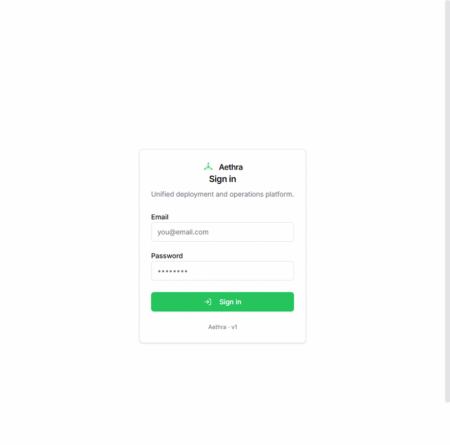

# Aethra

**Una sola plataforma para desplegar, enrutar, certificar, monitorear y operar tu infraestructura.**

[](https://github.com/Authoritt/Aethra/actions/workflows/ci.yml)
[](LICENSE)
[](https://dotnet.microsoft.com/)

> 🇬🇧 [Read this in English](README.md)



<sub>Una instalación nueva, de principio a fin: entrar → tres pendientes de configuración → crear el primer ambiente → la lista baja a dos. Grabado contra una instancia local desechable con la base vacía — el software corriendo de verdad, no un mockup.</sub>

Aethra unifica en un único sistema —con una base de datos compartida y una sola UI— lo que hoy te obliga
a saltar entre cuatro herramientas distintas: **despliegue Git→Docker** (en lugar de Coolify),
**reverse proxy + TLS automático** (en lugar de Traefik), **monitoreo de uptime** (en lugar de Uptime Kuma)
y **métricas de VMs y contenedores** (en lugar de Beszel). El proyecto, la URL pública, las variables de
entorno, el monitor que la vigila y la nota con sus credenciales viven en el mismo lugar — no en cuatro
lugares que nadie sincroniza.

**Multi-tenant nativo:** una `Template` (un repo Git) puede correr para N clientes (`Client`) en M
ambientes (`Instance`), cada uno con sus propias variables, secretos, dominio y deploy independiente. Una
sola imagen se construye y se despliega a todos los clientes que la usan — sin duplicar configuración.

**Pensado para que lo opere un agente, no solo una persona.** El servidor MCP embebido expone las
operaciones críticas como herramientas tipadas, y cada respuesta trae
`next_actions: [{ tool, why, suggested_args }]` — para que el agente sepa qué sigue en vez de tener que
deducir tu modelo de datos.

---

## Tu IA puede operar casi todo esto

No es un punto del roadmap. Apunta a Claude —o a cualquier agente con MCP— a `https://aethra/mcp`, dale una
API key con scopes, y operas tu infraestructura preguntando:

> **"Despliega el último main al ambiente de staging de la plantilla de facturación."**
> → `aethra_list_context` para ubicarlo, luego `aethra_deploy_instance_native`, y te
> reporta el resultado REAL del healthcheck en vez de dar por hecho que funcionó.

> **"¿Cuál de mis proyectos está caído ahora mismo?"**
> → `aethra_get_monitor_status` sobre todos los monitores, agrupado por proyecto.

> **"¿Esa VM nueva sí está reportando? ¿Cómo va de disco?"**
> → `aethra_query_metrics` — CPU, RAM, disco y stats por contenedor, saliendo del satélite.

> **"Ponle el dominio shop.acme.com a esa instancia."**
> → `aethra_attach_domain` crea el CNAME en Cloudflare, provisiona el certificado y cambia la ruta de YARP.

> **"Esta app necesita base de datos."**
> → `aethra_bind_service` provisiona un Postgres real con su usuario y contraseña, y te inyecta la
> cadena de conexión como env var y como secreto.

Dos decisiones de diseño hacen que esto sea seguro de dejar encendido:

- **La llave del agente no puede escalar.** Las API keys llevan scopes granulares (`deployments:write`,
  `projects:read`), y los endpoints que crean API keys o leen secretos son cookie-only: el agente puede
  desplegar a producción y aun así no puede darse permisos a sí mismo.
- **Los resultados son reales, no optimistas.** Las tools de deploy devuelven el resultado del
  healthcheck; las métricas vienen del satélite. Un agente que dice "desplegado" está repitiendo lo que
  la plataforma observó, no narrando lo que esperaba.

---

## Qué hace por dentro

| Capacidad | Cómo funciona |
|---|---|
| **Despliegue Git→Docker** | Webhook firmado HMAC dispara `Build` (clone shallow → docker/podman build → push al registry interno). Al completar, fan-out a N `Deployment` (pull → run → healthcheck → atomic swap de la ruta YARP). 1 Build, N Deployments. |
| **Reverse proxy + TLS** | YARP embebido en el proceso central. Las rutas viven en BD; al cambiar, `IProxyConfigService.Reload()` actualiza YARP en caliente. Let's Encrypt vía Certes con renovación automática (worker cada 1h, ventana configurable). |
| **Multi-tenant** | Auto-hostname `{template}-{client}-{env}.{base-domain}` al crear Instance. Custom domain opcional con CNAME Cloudflare. Variables y secretos se resuelven cascada `Instance > Client > Template > Project`. |
| **Monitoreo** | `MonitorWorker` ejecuta probes HTTP con tick configurable; cada probe en scope propio para no bloquearse. Cambios de estado emiten integration events que llegan a SignalR (UI live) y a la línea de tiempo del proyecto. |
| **Métricas VM + Docker** | Satélite ligero (.NET) conecta al central por SignalR (WebSocket persistente — solo egress 443 saliente, sin abrir puertos). Reporta CPU/RAM/disco/red del SO + stats por contenedor. Buffer SQLite local mientras la red falle, drena al reconectar. |
| **Servicios gestionados** | Postgres/Redis/RabbitMQ one-click vía plantillas. `ServiceBinding` provisiona BD/user/password reales y los inyecta como env vars + secrets en las apps que los usan. |
| **DNS Cloudflare** | Cliente HTTP contra API v4. Registros A/CNAME automáticos al adjuntar custom domain. Token cifrado en Settings, referenciado por nombre. |
| **Notas y PinnedFacts** | Markdown + imágenes por proyecto/template/instance. Los PinnedFacts (IPs, credenciales, comandos) se muestran en la tarjeta principal y se cifran en reposo. |
| **API + MCP** | REST con OpenAPI 3.1, auth dual (cookie para humanos, API keys con scopes granulares para clientes). Servidor MCP embebido en `https://aethra/mcp` con tools tipadas. |

---

## Arquitectura

```
┌────────────────────────────────────────────────────────────────┐
│  VM-Central                                                    │
│  ┌──────────────┐   ┌──────────────────────────────────────┐   │
│  │ apps/web     │   │ apps/api                             │   │
│  │ Next.js 16   │◄──┤ ASP.NET Core (.NET 10)               │   │
│  │ App Router   │   │  • YARP (reverse proxy + TLS)        │   │
│  └──────────────┘   │  • SignalR Hub (satellite + UI)      │   │
│                     │  • MCP server (tools para agentes)   │   │
│                     │  • Background workers                │   │
│                     │      Build, Deployment, Monitor,     │   │
│                     │      CertRenewal, OutboxDispatchers  │   │
│                     └──────────────────────────────────────┘   │
│                                                                │
│   ┌──────────────┐    ┌────────────────┐    ┌──────────────┐   │
│   │ PostgreSQL   │    │ Docker daemon  │    │ Registry     │   │
│   │ 12 schemas,  │    │ builds locales │    │ interno      │   │
│   │ 1 por módulo │    │ y servicios    │    │ (registry:2) │   │
│   └──────────────┘    └────────────────┘    └──────────────┘   │
└────────────────────────────▲───────────────────────────────────┘
                             │ SignalR (wss, egress only)
            ┌────────────────┴─────────┬─────────────────────┐
            │ VM-Satellite 1           │ VM-Satellite N      │
            │ apps/satellite (.NET)    │ ...                 │
            │ IContainerRuntime        │                     │
            │  ├─ DockerContainerRt    │                     │
            │  └─ PodmanContainerRt    │                     │
            │ Métricas SO + contenedores                     │
            └──────────────────────────┴─────────────────────┘
```

**Modular monolith con fronteras estrictas.** Cada `Modules.<X>` es un bounded context con su propio
schema PostgreSQL, su propio DbContext, sus aggregates y su outbox local. La comunicación cross-module es
exclusivamente vía `IIntegrationEvent` en `Aethra.Shared.Contracts` — nunca por referencia directa. Las
violaciones las detecta `tests/Aethra.ArchitectureTests` con NetArchTest (no se mergea código que cruce
módulos por la puerta de atrás).

**Por qué SignalR y no agentes pull.** Beszel (WebSocket+CBOR) y Netdata (HTTP streaming replication)
—las dos referencias más cercanas— usan push iniciado por el agente sobre conexión persistente. En Oracle
Cloud y similares los satélites están detrás de firewalls; push solo necesita egress 443.
Bidireccionalidad gratis: el central puede mandar comandos al satélite por el mismo socket (build, run,
stream logs). SignalR es el equivalente .NET nativo: reconexión automática con backoff, heartbeats,
streaming.

---

## Stack

- **Backend**: .NET 10, ASP.NET Core, EF Core 10, YARP, SignalR, MediatR, FluentValidation, Polly,
  Docker.DotNet, Certes (ACME/Let's Encrypt), SDK `ModelContextProtocol`.
- **Frontend**: Next.js 16 (App Router), TypeScript, Tailwind, `@microsoft/signalr`.
- **BD**: PostgreSQL 16 (12 schemas, uno por bounded context — `projects`, `deployments`, `proxy`,
  `monitoring`, …).
- **Secretos en reposo**: ASP.NET Data Protection con purposes por dominio (`aethra-integration-creds`,
  `aethra-webhook-secrets`, `aethra-cert-pfx`, `aethra-secrets-store`, …).
- **Tests**: NetArchTest (fences arquitectónicas), xUnit (handlers), Testcontainers para integración.

---

## Cómo arrancar

### Con Docker

```bash
git clone https://github.com/Authoritt/Aethra.git
cd Aethra/deploy
cp .env.example .env        # pon POSTGRES_PASSWORD y AETHRA_ADMIN_PASSWORD
docker compose up -d --build
```

Panel en <http://localhost:3000>, API en <http://localhost:5080>. El primer build compila las imágenes
de .NET y de Next, y no es rápido.

Las migraciones se aplican al arrancar porque el compose pone `Aethra__ApplyMigrationsOnStart=true`.
Es opt-in a propósito: un despliegue gestionado las corre desde su pipeline, y no quieres dos
instancias migrando a la vez. `/openapi/v1.json` se sirve siempre; fuera de `Development` exige autenticacion.

El compose levanta cuatro contenedores: el central, el panel Next.js, Postgres y un registry local al
que empuja el pipeline de build. El **satélite no está ahí a propósito** — va en cada máquina que
quieras que Aethra administre, y se instala desde la UI cuando el central esté arriba.

Dos cosas que conviene saber antes de apuntar esto a algo real:

- El contenedor del central monta `/var/run/docker.sock`. Eso es lo que le permite construir y correr
  tus contenedores, y también es acceso equivalente a root sobre el anfitrión. Es el mismo trato que
  hace cualquier herramienta de despliegue basada en Docker, pero hazlo sabiéndolo.
- El compose se niega a arrancar sin las dos claves puestas. No hay respaldo `changeme`.

> **Nota de honestidad:** este compose se cableó el 2026-07-31. Es estáticamente consistente con los
> Dockerfiles y con las claves de configuración que el código realmente lee, pero **todavía no se ha
> corrido de punta a punta en una máquina limpia.** Si eres el primero en probarlo,
> [un issue en cualquier sentido](../../issues) —funcionó, o aquí se rompió— es lo más útil que puedes
> mandarnos ahora mismo.

### Tu primer inicio de sesión

No hay página de registro, y no debería haberla en algo que puede desplegar a tu producción.
No creas una cuenta: la primera se crea sola.

En el primer arranque, si la tabla de usuarios está vacía, Aethra siembra un admin con
`AETHRA_ADMIN_EMAIL` y `AETHRA_ADMIN_PASSWORD` de tu `.env` y le asigna el rol admin. Entras
con esos. Por eso mismo el compose se niega a arrancar si falta alguna: sin cuenta por
defecto, sin nada adivinable.

De ahí en adelante, los demás usuarios se crean desde **Ajustes → Usuarios**, con roles
(admin, desarrollador, visualizador), scopes por endpoint y segundo factor TOTP opcional.
Sin tocar `curl`.

Si la tabla de usuarios volviera a quedar vacía, el login valida contra esas mismas variables
de entorno y emite claims equivalentes a admin, solo para que esa primera sesión pueda crear
usuarios reales. En cuanto existe uno en la base de datos, ese respaldo deja de usarse.

### Desde el código

Necesitas **.NET 10 SDK**, **Node 24+** y un **PostgreSQL 16** alcanzable.

```bash
createdb -U postgres aethra

export Identity__AdminEmail="tu@correo.com"
export Identity__AdminPasswordSeed="tu-clave-segura"

dotnet run --project apps/api             # central, http://localhost:5000
cd apps/web && npm install && npm run dev  # panel,   http://localhost:3000
dotnet run --project apps/satellite        # opcional: satélite local
```

Si no seteas `Identity__*`, en desarrollo cae a `admin@aethra.local` / `aethra-dev`.
**Cámbialo antes de exponer Aethra a cualquier cosa.**

¿Vienes de Coolify? Mira [`docs/migration-from-coolify.md`](docs/migration-from-coolify.md) y los scripts
asistidos en `scripts/migrate-from-coolify.{sh,ps1}`.

---

## API y MCP

REST completo con OpenAPI 3.1 en `/openapi/v1.json`. Las operaciones críticas se exponen también como
tools MCP en `https://aethra/mcp`:

- `aethra_list_context` — snapshot agregado (proyectos, VMs, servicios, dominios).
- `aethra_create_template` / `aethra_create_client` / `aethra_create_instance`.
- `aethra_deploy_instance_native`, `aethra_list_deploys`, `aethra_get_deploy_logs`, `aethra_explain_failed_deploy`.
- `aethra_attach_domain`, `aethra_set_env_vars`, `aethra_list_secrets`.
- `aethra_bind_service` (provisiona Postgres/Redis/RabbitMQ + inyecta credenciales).
- `aethra_query_metrics`, `aethra_get_monitor_status`, `aethra_add_note`.

Las respuestas incluyen `next_actions: [{ tool, why, suggested_args }]` para que el agente sepa qué
proponer después sin tener que adivinar el modelo de datos.

---

## Seguridad

- Auth dual: cookie HttpOnly para UI humana, API keys con scopes granulares para agentes y clientes externos.
- Cada endpoint REST exige scope `<resource>:<read|write>`. La cookie equivale a admin; las API keys solo
  a sus scopes declarados.
- Endpoints sensibles (`/auth/me`, `/auth/logout`, gestión de API keys, integraciones de Settings) son
  **cookie-only** — bloquea bypass desde una API key.
- HMAC SHA-256 con `CryptographicOperations.FixedTimeEquals` en webhooks Git, body raw.
- Webhook secrets, integration credentials, PinnedFacts y service binding passwords cifrados en reposo con
  Data Protection (purposes separados para que un compromiso no exponga el resto).
- TLS automático Let's Encrypt; HTTP-01 servido por el propio YARP.
- Tests de arquitectura impiden que el Domain referencie EF/ASP.NET y que un módulo importe internals de otro.

¿Encontraste una vulnerabilidad? Lee [SECURITY.md](SECURITY.md) — no abras un issue público.

---

## Contribuir

Las contribuciones son bienvenidas. [`CONTRIBUTING.md`](CONTRIBUTING.md) explica cómo compilarlo, cómo
correr las pruebas y las dos reglas que mantienen vivo este código: fronteras de módulo y dominio puro.
Al participar aceptas el [Código de Conducta](CODE_OF_CONDUCT.md).

## Apoyar el proyecto

Si Aethra te ahorra un VPS, una tarde o una suscripción, patrocinarlo mantiene el trabajo andando — mira
el botón **Sponsor** en GitHub.

## Licencia

[GNU Affero General Public License v3.0](LICENSE) — Copyright 2026 Authorit.

Úsalo, modifícalo y autohospédalo con libertad. Si publicas un Aethra modificado como servicio al
que otros llegan por red, la AGPL te pide publicar esos cambios bajo la misma licencia.
